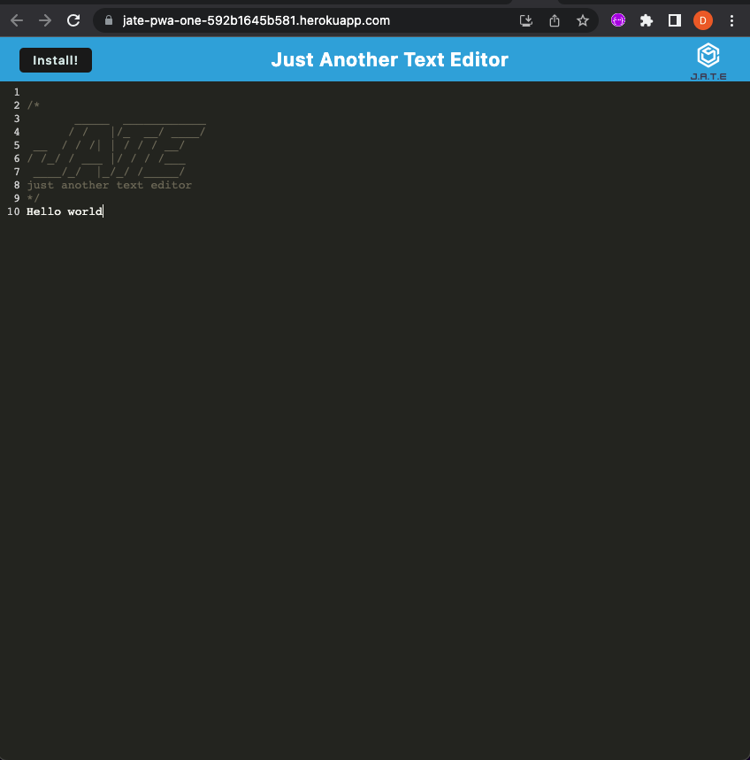
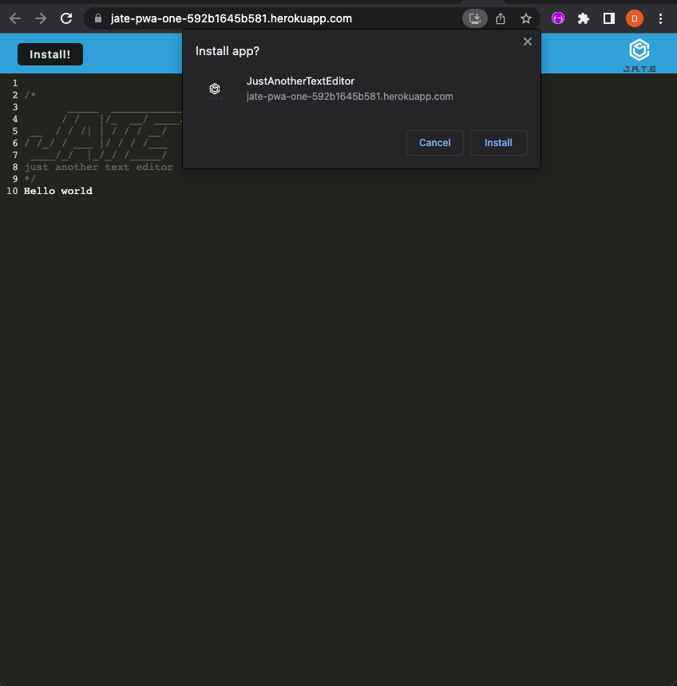
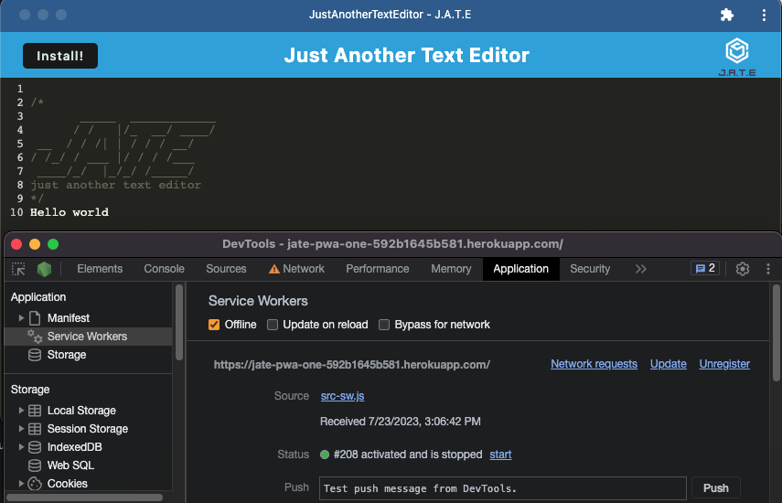

# PWA Text Editor

## Description

PWA Text Editor is a powerful text editing application that allows users to write and save text ON or OFFline. It uses IndexedDB to instantly store the users work, without clicking a save button, ensuring they never lose their work. The application comes with a service worker to pre-cache static assets to allow for offline usage. With one click, users can install the web application on their desktop, giving them the feel of a native app experience. The application is configured with webpack, allowing effective management of the service worker and generation of the manifest.json file.

## Deployment Link

View the deployed application here! ---> [PWA-Text-Editor](https://jate-pwa-one-592b1645b581.herokuapp.com/)

## Mock-Up

The following images demonstrate the application functionality:

## Questions

Feel free to contact me here if you have questions! :

[LinkedIn](https://www.linkedin.com/in/derekszcz45/) : [Github](https://github.com/Lone1ne)
